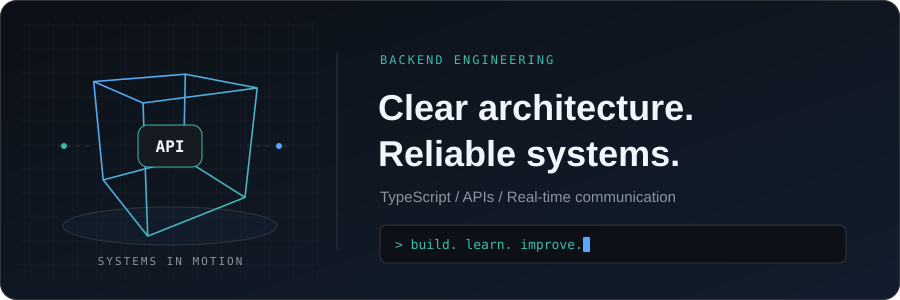
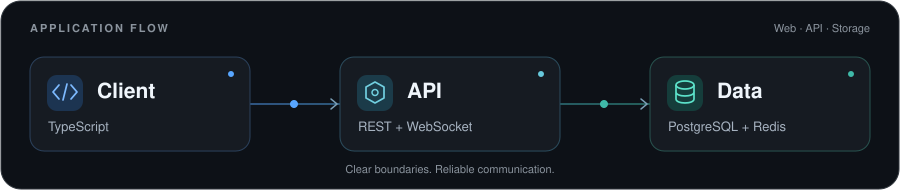

# Wuttichai Sukantho

<!-- markdownlint-disable MD033 -->

<pre>
██╗    ██╗██╗   ██╗████████╗████████╗██╗ ██████╗██╗  ██╗ █████╗ ██╗
██║    ██║██║   ██║╚══██╔══╝╚══██╔══╝██║██╔════╝██║  ██║██╔══██╗██║
██║ █╗ ██║██║   ██║   ██║      ██║   ██║██║     ███████║███████║██║
██║███╗██║██║   ██║   ██║      ██║   ██║██║     ██╔══██║██╔══██║██║
╚███╔███╔╝╚██████╔╝   ██║      ██║   ██║╚██████╗██║  ██║██║  ██║██║
 ╚══╝╚══╝  ╚═════╝    ╚═╝      ╚═╝   ╚═╝ ╚═════╝╚═╝  ╚═╝╚═╝  ╚═╝╚═╝
</pre>

**Software Developer · Backend Engineer** 
Hat Yai, Songkhla, Thailand · UTC+7

I build backend services, web applications, and communication systems with TypeScript. My focus is clear architecture, reliable APIs, and software that is straightforward to maintain and operate.

Currently, I work as a **Software Developer at M Biz Consultant Co., Ltd.**, combining web and mobile development with VoIP infrastructure and real-time communication.

[Portfolio](https://wuttichai-web-41c80.firebaseapp.com/) · [LinkedIn](https://www.linkedin.com/in/wuttichai-sukantho-0939b1241/) · [GitHub](https://github.com/WuttichaiSukantho)

  
  
  
  
  

 

[Focus](#engineering-focus) · [Portfolio](#selected-work) · [Stack](#technical-toolkit) · [Experience](#experience) · [Education](#education) · [Activity](#github-activity)

## Engineering focus

- **Backend and APIs:** TypeScript services, REST API design, and OpenAPI documentation.
- **Architecture:** Small modules, clear domain boundaries, and testable business logic.
- **Security and reliability:** JWT authentication, environment validation, rate limiting, and caching.
- **Real-time communication:** WebSocket applications, SIP registration, call routing, and VoIP infrastructure.
- **Delivery:** Containerized development and deployment with Docker and GitHub CI/CD.

### Engineering practices

| Focus | What I work on |
| --- | --- |
| API design | REST endpoints and OpenAPI documentation that make service interfaces clear. |
| Authentication | Registration, login, and refresh-token flows using JWT. |
| Modular architecture | Domain separation, object-oriented design, and small modules with explicit responsibilities. |
| Performance | Caching, compression, rate limiting, and server-performance optimization. |
| Configuration and security | Environment validation and secure middleware design. |
| Communication systems | WebSocket connections, SIP registration, call routing, and push notifications. |
| Operations | Containerized development and deployment workflows. |

Architectural principles

I value small, well-defined modules and explicit boundaries between domains. I aim to keep business logic testable and independent of infrastructure concerns, using object-oriented patterns and class-grouped responsibilities where they improve cohesion and maintainability.

My current direction is to strengthen secure API design, improve performance and operational reliability, and build backend systems that remain understandable as they grow.

## Selected work

### [Personal portfolio](https://wuttichai-web-41c80.firebaseapp.com/)

An interactive overview of my work, technical background, and career, built with **React, Vite, TypeScript, and Firebase**.

- Responsive layouts for desktop and mobile.
- English and Thai language options, with theme controls.
- Home, Playground, About, Story, Experience, Education, and Contact sections.
- Sticky navigation and layouts adapted for desktop and mobile use.
- Animated page-load and section transitions, with interactive hover states.
- Career and education timelines, professional profile links, and structured sharing metadata.

[Explore the portfolio →](https://wuttichai-web-41c80.firebaseapp.com/)

### Augmented reality web development

During my internship at **Stream South Technology**, I worked on TypeScript and React web applications, including augmented reality experiences for the **nimitr.art** project.

[Visit nimitr.art →](https://nimitr.art/)

## Technical toolkit

| Area | Technologies |
| --- | --- |
| Languages | TypeScript, JavaScript |
| Backend | Bun, Node.js, Elysia, Express.js, REST APIs, OpenAPI |
| Web | React, Vite |
| Mobile | Flutter, Firebase push notifications |
| Data | PostgreSQL, MongoDB, Redis, Prisma ORM |
| Real-time and telephony | WebSocket, SIP, OpenSIPS, Asterisk, FreePBX |
| Cloud and delivery | Firebase, Docker, GitHub CI/CD |

### Engineering map

How the technologies in my toolkit connect across the work I do.

```mermaid
flowchart LR
  accTitle: Engineering map
  accDescr: A map of related engineering skills. TypeScript connects web and API work. API work connects mobile, real-time communication, data, and delivery. Real-time communication connects VoIP tooling.
  ts["TypeScript"]
  class ts core
  web["Web&#58; React / Vite"]
  class web area
  backend["APIs&#58; Bun / Node.js / Elysia"]
  class backend area
  mobile["Mobile&#58; Flutter / Firebase"]
  class mobile area
  realtime["Real-time&#58; WebSocket / SIP"]
  class realtime area
  voice["VoIP&#58; OpenSIPS / Asterisk / FreePBX"]
  class voice area
  data["Data&#58; PostgreSQL / Redis / Prisma"]
  class data area
  delivery["Delivery&#58; Docker / GitHub CI"]
  class delivery area
  ts --- web
  ts --- backend
  backend ---|REST| mobile
  backend --- realtime
  realtime --- voice
  backend --- data
  backend --- delivery
classDef core fill:#3178c6,stroke:#79c0ff,color:#ffffff
classDef area fill:#122032,stroke:#315b76,color:#e6edf3
```

<!-- mermaid:id=engineering_map -->

## Experience

```mermaid
timeline
  accTitle: Career timeline
  accDescr: Career milestones&#58; Isuzu Hatyai summer internship in 2019, Stream South Technology developer internship in 2023, software developer at ADot in 2024, and software developer at M Biz Consultant from 2025.
  section Career timeline
    2019 : Summer Intern - Isuzu Hatyai
    2023 : Developer Intern - Stream South Technology &#40;TypeScript / React / AR web&#41;
    2024 : Software Developer - ADot
    2025 : Software Developer - M Biz Consultant &#40;TypeScript / React / Flutter / VoIP&#41;
```

<!-- mermaid:id=career_timeline -->

### Software Developer · M Biz Consultant Co., Ltd.

**January 2025 – Present** · Full-time · On-site · Thailand

- **Web:** Develop applications with TypeScript and React.
- **Mobile:** Build applications with Flutter and integrate Firebase push notifications.
- **Real-time systems:** Implement WebSocket communication between applications and services.
- **Telephony:** Work with OpenSIPS, Asterisk, and FreePBX on SIP communication, dynamic registration, and call routing.
- **Performance:** Optimize server performance for communication infrastructure.

### Software Developer · ADot

**May 2024 – December 2024** · Full-time · On-site · Thailand

### Developer Intern · Stream South Technology

**July 2023 – October 2023** · Hat Yai, Thailand

- Developed TypeScript and React web applications, including augmented reality experiences for [nimitr.art](https://nimitr.art/).

Earlier experience

**Summer Intern · Isuzu Hatyai Co., Ltd.** 
March 2019 – May 2019 · Hat Yai, Thailand

## Education

**Bachelor of Business Administration · Business Information System** 
Rajamangala University of Technology Srivijaya 
July 2020 – May 2023 · Grade: **3.68**

**Vocational Certificate · Business Computer** 
Amnuaywit Hatyai Technology College · 2016 – 2020

Earlier education

| Period | School | Program |
| --- | --- | --- |
| 2014 – 2016 | Hatyai Wittayalai Somboonkulkanya School | Junior High School · Science-Math Ability |
| 2005 – 2014 | Sahasart Wittayakarn School | — |

## GitHub activity

<!-- Provider documentation: https://github.com/vn7n24fzkq/github-profile-summary-cards#profile-details-card -->
<a href="https://github.com/WuttichaiSukantho?tab=overview">
  <picture>
    <source media="(prefers-color-scheme: dark)" srcset="https://github-profile-summary-cards.vercel.app/api/cards/profile-details?username=WuttichaiSukantho&amp;theme=github_dark&amp;name=Wuttichai%20Sukantho" />
    <source media="(prefers-color-scheme: light)" srcset="https://github-profile-summary-cards.vercel.app/api/cards/profile-details?username=WuttichaiSukantho&amp;theme=github&amp;name=Wuttichai%20Sukantho" />
    
  </picture>
</a>

[View contributions on GitHub](https://github.com/WuttichaiSukantho?tab=overview)

### Public activity statistics

<picture>
  <source media="(prefers-color-scheme: dark)" srcset="https://github-profile-summary-cards.vercel.app/api/cards/stats?username=WuttichaiSukantho&amp;theme=github_dark" />
  <source media="(prefers-color-scheme: light)" srcset="https://github-profile-summary-cards.vercel.app/api/cards/stats?username=WuttichaiSukantho&amp;theme=github" />
  
</picture>

These statistics reflect activity visible to the card provider. Private work may not be represented.

## Connect

| Find me | Link |
| --- | --- |
| Work and background | [Personal portfolio](https://wuttichai-web-41c80.firebaseapp.com/) |
| Professional network | [LinkedIn](https://www.linkedin.com/in/wuttichai-sukantho-0939b1241/) |
| Repositories and activity | [GitHub](https://github.com/WuttichaiSukantho) |
| Career profile | [JobsDB](https://th.jobsdb.com/profiles/%E0%B8%A7%E0%B8%B8%E0%B8%92%E0%B8%B4%E0%B8%8A%E0%B8%B1%E0%B8%A2-%E0%B8%AA%E0%B8%B8%E0%B8%84%E0%B8%B1%E0%B8%99%E0%B9%82%E0%B8%91-2vytXlpx0N) |

Based in **Hat Yai, Songkhla, Thailand** · **Asia/Bangkok (UTC+7)**.
